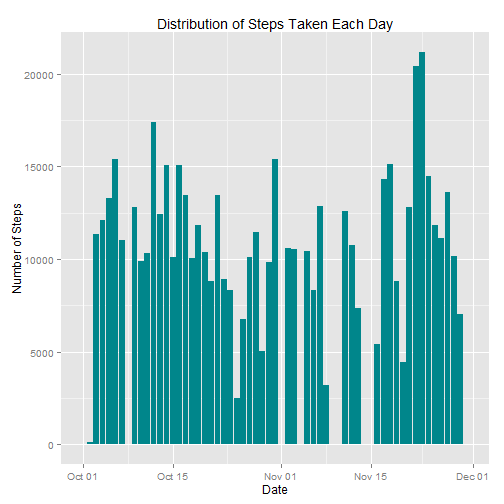
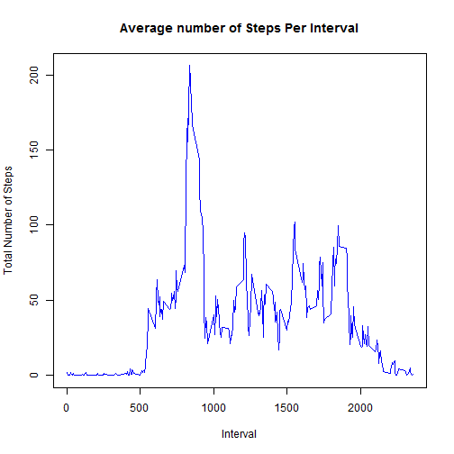
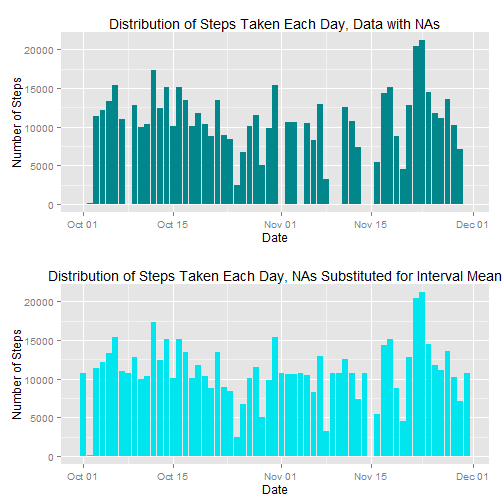
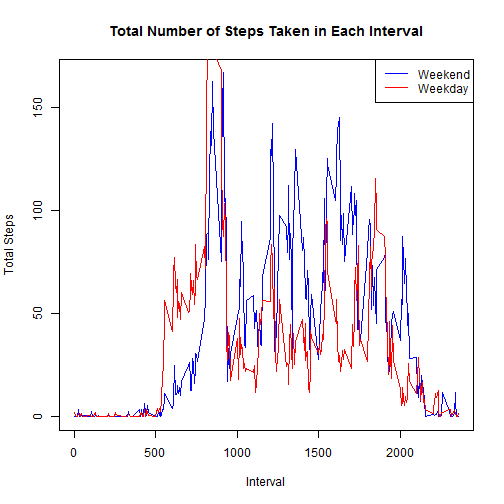

by Anna Korsakova Bain

#  Reproducible Research: Peer Assessment 1

## Loading and preprocessing the data

1. Load the data

2. Process/transform the data (if necessary) into a format suitable for analysis


 

```r
    #load necessary libraries
    library(ggplot2)
    library(plyr)
    library(sqldf)
    library("gridExtra")

    #set workking directory, unzip, and load data
    setwd("~/DataScienceCertificiation/RepData_PeerAssessment1")
    unzip("activity.zip")
    DF <- read.csv("activity.csv", header = TRUE, na.strings = "NA")
    
    #convert the date column to datatype Date
    DF$date <- as.Date(DF$date,"%Y-%m-%d" )
```


## What is mean total number of steps taken per day?

1. Make a histogram of the total number of steps taken each day


```r
    #summarize data by date
    DF_eachDay <- ddply(DF, .(date), summarize, totalSteps=sum(steps))
    
    #plot number of steps taken each day in a historgram
    qplot(x=date, y=totalSteps, 
          data=DF_eachDay, geom="bar", stat="identity",
          position="dodge", main="Distribution of Steps Taken Each Day", 
          xlab="Date", ylab="Number of Steps", fill = I("turquoise4"))
```

 


2. Calculate and report the mean and median total number of steps taken per day


```r
    mean(DF_eachDay$totalSteps, na.rm=T)
```

```
## [1] 10766.19
```

```r
    median(DF_eachDay$totalSteps, na.rm=T)
```

```
## [1] 10765
```


## What is the average daily activity pattern?

1. Make a time series plot (i.e. type = "l") of the 5-minute interval (x-axis) and the average number of steps taken, averaged across all days (y-axis)


```r
    #average the number of steps taken by interval, plot using a time series plot
    DF_eachInterval <- ddply(DF, .(interval), summarize, totalSteps=mean(steps, na.rm=T))
    
    plot(DF_eachInterval, type="l", col="blue", main="Average number of Steps Per Interval",
        ylab="Total Number of Steps", xlab="Interval")
```

 


2. Which 5-minute interval, on average across all the days in the dataset, contains the maximum number of steps?


```r
    DF_eachInterval[which.max( DF_eachInterval[,2] ),]
```

```
##     interval totalSteps
## 104      835   206.1698
```


## Imputing missing values

Note that there are a number of days/intervals where there are missing values (coded as NA). The presence of missing days may introduce bias into some calculations or summaries of the data.

1. Calculate and report the total number of missing values in the dataset (i.e. the total number of rows with NAs)


```r
    sum(is.na(DF))
```

```
## [1] 2304
```


2. Devise a strategy for filling in all of the missing values in the dataset. The strategy does not need to be sophisticated. For example, you could use the mean/median for that day, or the mean for that 5-minute interval, etc.


```r
    #to substitute the NA values in steps, fill in each NA with mean for that interval
    new_DF <- sqldf('SELECT d.date, d.interval, 
                     CASE WHEN steps IS NULL THEN i.totalSteps ELSE steps END AS noNASteps 
                    FROM DF d LEFT OUTER JOIN DF_eachInterval i 
                      on d.interval = i.interval')
```


3. Create a new dataset that is equal to the original dataset but with the missing data filled in.


```r
    new_DF_eachDay <- ddply(new_DF, .(date), summarize, totalSteps=sum(noNASteps))
```


4. Make a histogram of the total number of steps taken each day and Calculate and report the mean and median total number of steps taken per day. Do these values differ from the estimates from the first part of the assignment? What is the impact of imputing missing data on the estimates of the total daily number of steps?


```r
    #plot the old and new dataset next to each other to quickly see differences
    require(gridExtra)
    plot1 <- qplot(x=date, y=totalSteps, 
          data=DF_eachDay, geom="bar", stat="identity",
          position="dodge", main="Distribution of Steps Taken Each Day, Data with NAs", 
          xlab="Date", ylab="Number of Steps", fill = I("turquoise4"))
    plot2 <- qplot(x=date, y=totalSteps, 
          data=new_DF_eachDay, geom="bar", stat="identity",
          position="dodge", main="Distribution of Steps Taken Each Day, NAs Substituted for Interval Mean", 
          xlab="Date", ylab="Number of Steps", fill = I("turquoise2"))
    grid.arrange(plot1, plot2, nrow=2)
```

 

```r
    #calculate the mean and the median steps taken per day using new dataset
    mean(new_DF_eachDay$totalSteps)
```

```
## [1] 10766.19
```

```r
    median(new_DF_eachDay$totalSteps)
```

```
## [1] 10766.19
```


## Are there differences in activity patterns between weekdays and weekends?

1. Create a new factor variable in the dataset with two levels - "weekday" and "weekend" indicating whether a given date is a weekday or weekend day.


```r
    #add weekend/weekday factor to dataset
    day <- weekdays(new_DF$date)
    new_DF <- cbind(new_DF, day)
    new_DF$dayType <- rep(NA, nrow(new_DF))
    new_DF[new_DF$day == "Monday", ][, "dayType"] <- "Weekday"
    new_DF[new_DF$day == "Tuesday", ][, "dayType"] <- "Weekday"
    new_DF[new_DF$day == "Wednesday", ][, "dayType"] <- "Weekday"
    new_DF[new_DF$day == "Thursday", ][, "dayType"] <- "Weekday"
    new_DF[new_DF$day == "Friday", ][, "dayType"] <- "Weekday"
    new_DF[new_DF$day == "Saturday", ][, "dayType"] <- "Weekend"
    new_DF[new_DF$day == "Sunday", ][, "dayType"] <- "Weekend"
    
    new_DF$dayType <- as.factor(new_DF$dayType)
```


2. Make a panel plot containing a time series plot (i.e. type = "l") of the 5-minute interval (x-axis) and the average number of steps taken, averaged across all weekday days or weekend days (y-axis). 


```r
    #average the number of steps taken by interval, plot using a time series plot
    new_DF_eachInterval <- ddply(new_DF, .(interval, dayType), summarize, totalSteps=mean(noNASteps))
    
    new_DF_weekend <- subset(new_DF_eachInterval, dayType == "Weekend")
    new_DF_weekday <- subset(new_DF_eachInterval, dayType == "Weekday")
    
    plot(new_DF_weekend$interval, new_DF_weekend$totalSteps, type = "l", col="blue",
          main="Total Number of Steps Taken in Each Interval", xlab="Interval", ylab="Total Steps")
    #add additional lines
    lines(new_DF_weekday$interval, new_DF_weekday$totalSteps,  col="red")
    #add legend
    legend("topright", legend = c("Weekend","Weekday"),lty=c(1,1),col=c("blue","red"))
```

 
    
